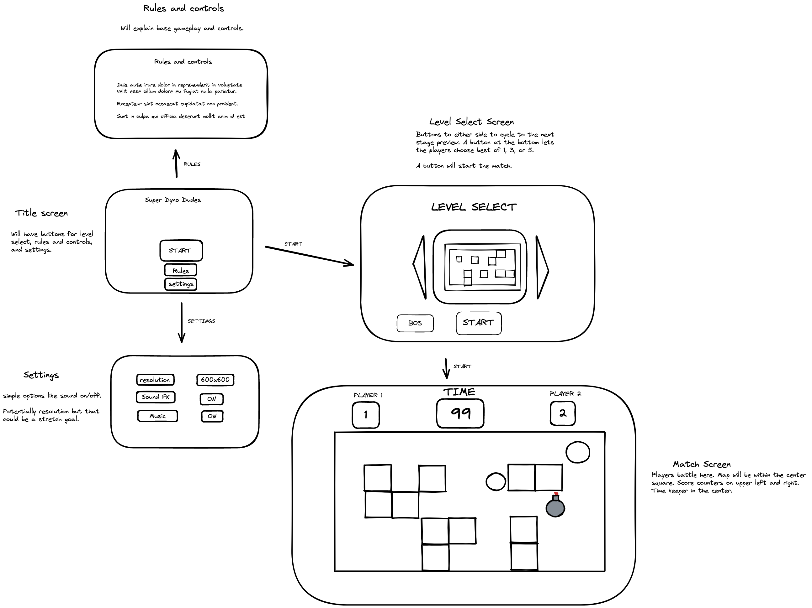

# Boom for improvement

My project is a 1 vs 1 bomb placing game. It uses grid based movement and the goal is to blow up your opponent. I made it as a project for a course I am taking. 

Player one moves with the arrow keys and places bombs using  the shift key. Player 2 moves with WASD and places bombs with the spacebar.

User stories:
As a player, I want to have my bombs go off after a timer.
As a player, I want sound effects going off with my bombs.
As a player, I want obstacles that will block player movement and bomb blasts.
As a player, I want to be able to replay my opponent right after a match.

The map is drawn on the canvas using an array as a reference. Different values in the array correspond to different sections of my tile map. It calculates positions and collisions based off another array which is updated as players move and bombs are placed. 

I use an interval timer to set my game tick rate. Every tick it clears my canvas, redraws objects, and updates variables. 

The bombs and explosions are instantiated from 2 classes and are added to arrays. The arrays are run through every tick which draws each object and subtracts from a variable I am using as a timer on each object. When that value is below 0 they explode or fade away. 

The bombs change sprites using a timer that changes the position on the tile map from which they are drawn. The explosions reference the position of the bombs and place explosions in the open spots in their position and the 4 cardinal directions around them.

The only unsolved problems I ran into was autoplaying music and the death bombs overlapping with the game over pop up. Google chrome seems to require interaction before you play music and I didn't find a way around that to allow music auto playing without interaction from the player. The explosions over pop up is something I haven't messed with too much.

I did everything I tried to do, though there are a lot of features I'd like to add. Power ups, kicking bombs away, and multiple maps were possible features I did not get around to doing. A far off one would be swapping fully to fluid movement and collision detection rather than the grid movement I'm using right now.

//resources
Sprite sheet
https://opengameart.org/content/bomb-party-the-second-expansion

Bomb sound effect
https://audiosoundclips.com/8-bit-explosion-blast-sound-effects-sfx/

Music is from a music pack I had gotten in an asset bundle awhile ago.

